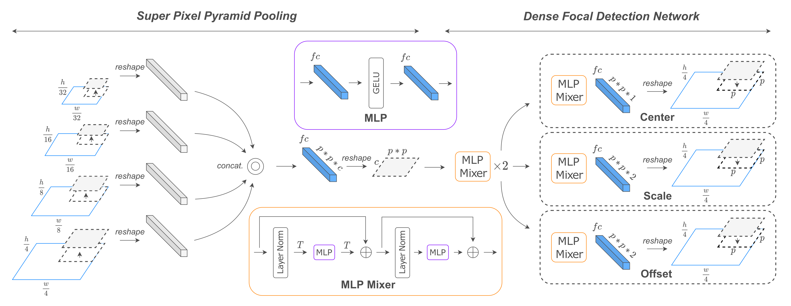
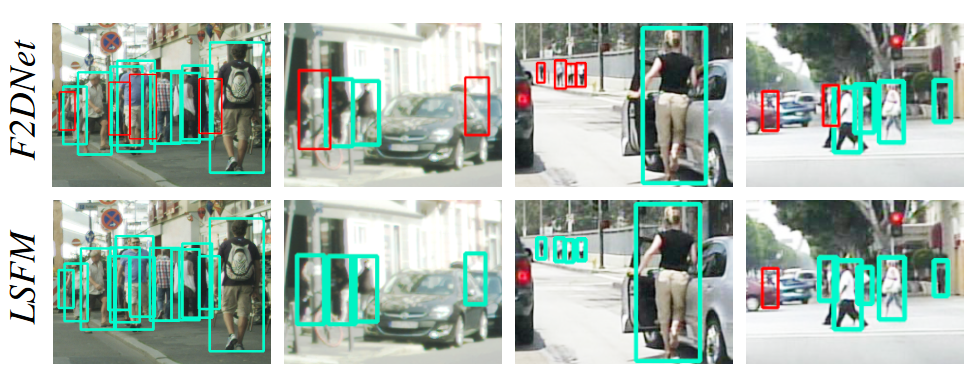

[](https://paperswithcode.com/sota/pedestrian-detection-on-citypersons?p=localized-semantic-feature-mixers-for)

[](https://paperswithcode.com/sota/pedestrian-detection-on-caltech-pedestrian?p=localized-semantic-feature-mixers-for)

[](https://paperswithcode.com/sota/pedestrian-detection-on-tju-ped-traffic?p=localized-semantic-feature-mixers-for)

# LSFM



LSFM or Localized Semantic Feature Mixers is a two-staged F2DNet based pedestrian detector, which utilizes efficient SP3 and DFDN module to achieve state-of-the-art results.



### Installation
Please refer to [base repository](https://github.com/hasanirtiza/Pedestron) for step-by-step installation. 

### List of detectors

In addition to configuration for different detectors provided in [base repository](https://github.com/hasanirtiza/Pedestron) we provide configuration for F2DNet.


### Following datasets are currently supported 
* [Caltech](http://www.vision.caltech.edu/Image_Datasets/CaltechPedestrians/)
* [CityPersons](https://github.com/cvgroup-njust/CityPersons)
* [EuroCity Persons](https://eurocity-dataset.tudelft.nl/)

### Datasets Preparation
Please refer to base repository for dataset preparation.


# Benchmarking 
### Benchmarking of LSFM on pedestrian detection datasets
| Dataset            | &#8595;Reasonable | &#8595;Small | &#8595;Heavy | 
|--------------------|:-----------------:|:------------:|:------------:|
| CityPersons        |      **8.5**      |   **8.8**    |   **31.9**   | 
| EuroCityPersons    |      **4.7**      |   **9.9**    |   **23.8**   | 
| Caltech Pedestrian |        3.1        |     3.4      |   **35.8**   |

### Benchmarking LSFM in progressive fine-tuning settigns
| Dataset            | Config                                                                                                                                                   | Model                                                                                   | &#8595;Reasonable | &#8595;Small | &#8595;Heavy | 
|--------------------|----------------------------------------------------------------------------------------------------------------------------------------------------------|-----------------------------------------------------------------------------------------|:-----------------:|:------------:|:------------:|
| CityPersons        | cascade_hrnet                                                                                                                                            | Cascade Mask R-CNN                                                                      |        7.5        |     8.0      |     28.0     |
| CityPersons        | [tju_ecp_cp](https://github.com/AbdulHannanKhan/F2DNet/blob/lsfm/configs/lsfm/cp/7_hr_with_mixup_exp/h2x4_3focus_neck_1_head_32c_mixup_width_refine.py)                                                         | LSFM |      **6.7**      |   **6.7**    |   **23.5**   |
| CityPersons        | [ecp_cp](https://github.com/AbdulHannanKhan/F2DNet/blob/master/configs/f2dnet/cp/ecp_sup.py)                                                             | [F2DNet](https://drive.google.com/file/d/1IrwvdLtpOjUpmz2_IXWENbVNAQtEZKn-/view?usp=sharing) |        7.8        |     9.4      |     26.2     |
| Caltech Pedestrian | cascade_hrnet                                                                                                                                            | Cascade Mask R-CNN                                                                      |        1.7        |              |     25.7     |
| Caltech Pedestrian | [ecp_caltech](https://github.com/AbdulHannanKhan/F2DNet/blob/lsfm/configs/lsfm/caltech/h2x4_3focus_neck_1_head_32c_mixup_width_refine_2x16_ecp_cal.py) | LSFM |      **1.0**      |   **0.2**    |   **19.5**   |
| Caltech Pedestrian | [ecp_cp_caltech](https://github.com/AbdulHannanKhan/F2DNet/blob/master/configs/f2dnet/caltech/ecp_cp_sup.py)                                             | [F2DNet](https://drive.google.com/file/d/1DzcKR-tKy-Oa6uVoiYUt_q_7h5iwwCeh/view?usp=sharing) |        1.7        |     2.1      |     20.4     |


# References

* [Pedestron](https://openaccess.thecvf.com/content/CVPR2021/papers/Hasan_Generalizable_Pedestrian_Detection_The_Elephant_in_the_Room_CVPR_2021_paper.pdf)

### Please cite the following work
[CVPR2023](https://openaccess.thecvf.com/content/CVPR2023/papers/Khan_Localized_Semantic_Feature_Mixers_for_Efficient_Pedestrian_Detection_in_Autonomous_CVPR_2023_paper.pdf)
```
@inproceedings{khan2023localized,
  title={Localized Semantic Feature Mixers for Efficient Pedestrian Detection in Autonomous Driving},
  author={Khan, Abdul Hannan and Nawaz, Mohammed Shariq and Dengel, Andreas},
  booktitle={Proceedings of the IEEE/CVF Conference on Computer Vision and Pattern Recognition},
  pages={5476--5485},
  year={2023}
}
```
[ICPR2022](https://arxiv.org/pdf/2203.02331.pdf)
```
@inproceedings{khan2022f2dnet,
  title={F2DNet: fast focal detection network for pedestrian detection},
  author={Khan, Abdul Hannan and Munir, Mohsin and van Elst, Ludger and Dengel, Andreas},
  booktitle={2022 26th International Conference on Pattern Recognition (ICPR)},
  pages={4658--4664},
  year={2022},
  organization={IEEE}
}
```
